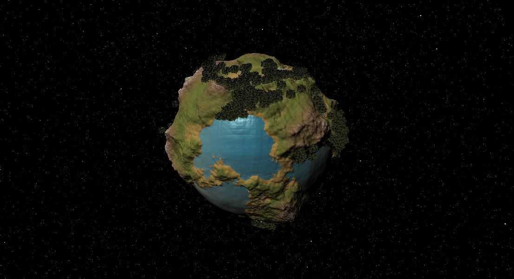

# Planet-Generator

Planet Generator is an opensource unity tool for generating procedural planets, automatically placing objects such as trees and applying automatic surface material.

  

## Features

- Terrain generation
- Mountain generation
- Placing objects such as trees
- LODs with custom resolution
- Automatic surface material 
- Water surface
- Camera controller
- Saving/loading planets
- Completely customizable
- Opensource

## Demo

  
- You can try a demo desktop application that shows most of the tool's features. It is available on the itch.io website, where the .unitypackage is also available for download: https://honzakolek.itch.io/planet-generator

 

## Documentation

The plugin is intended exclusively for use with the **URP** unity render pipeline. The project was created in unity version **2021.3.3.f1** and should support all newer versions.

### Installation

The best way to install the plugin in your unity project is to download **.unitypackage** from :itch. Drag and drop the package into your Assets folder and click on import. The second option is to download the entire repository. Before using the plugin, I recommend trying the demo app from https://honzakolek.itch.io/planet-generator to get a sense of all the features.

### Classes and functions

#### Planet.cs

The Planet class represents a planet object. It has various properties and methods related to generating the planet's mesh, controlling the level of detail, painting the material, and generating instances such as trees. It also contains references to other components such as the PlanetCanvas and ExportManager.

- **`Initialize()`**: This function initializes the planet mesh by creating the planet meshes for each level of detail, adding a mesh renderer and mesh filter to each mesh, and generating the planet mesh.

- **`GeneratePlanetObject()`**: This function initializes the planet mesh by calling the `Initialize()` function.

- **`PaintPlanet()`**: This function updates the planet material variables such as the grass height, rock height, beach size, transition smoothness, and ocean level.

- **`GeneratePlanet()`**: This function generates the meshes for each region and adds a mesh collider to each region.

- **`GenerateInstances()`**: This function generates instances such as trees using the `InstancingManager` class.

#### PlanetMesh.cs

The PlanetMesh class is responsible for generating a mesh for a planet's surface using a noise function to create terrain and mountain points for the vertices. The class takes a Mesh object, resolution, and a local Y-axis vector as inputs. The following are the functions available in the class:

- **`CreateMesh()`** - This function creates a mesh by generating vertices and triangles. It initializes the required variables, calculates the progress and index, generates cube and sphere points, and generates triangles. Finally, it clears the mesh and sets the vertex and triangle data, and recalculates the normals.

- **`GetGeneratedPoint()`** - This function calculates the elevation and the first layer value for a given point on the sphere. It then calculates the mountain point and applies it to the elevation to get the final point. It returns the final point.

- **`GetTerrainPoint()`** - This function calculates the noise value using a noise function for a given point on the sphere. It iterates through the noise functions, updates the noise value and iteration parameters, applies sea level and strength settings, and returns the final noise value.

- **`GetMountainPoint()`** - This function calculates the noise value using a noise function for a given point on the sphere. It iterates through the noise functions, updates the noise value and iteration parameters, and returns the final noise value multiplied by the mountain strength setting.

#### PlanetSettings.cs

The PlanetSettings class is used to store and manipulate the various settings related to generating a planet in a Unity project. It is marked as Serializable, which allows it to be easily stored and loaded within Unity. The class includes various public fields that allow for the customization of parameters such as the general properties of the planet, base terrain generation, mountain generation, instancing of trees, and brush settings.

#### InstancingManager.cs

This class, called InstancingManager, is responsible for generating instances of a tree prefab based on certain settings. It also includes the ability to clear all instances. The script includes a singleton instance and uses raycasting to find a suitable position for each instance.

- **`generateInstances()`**: Generates instances based on the current settings. It first checks if a specific seed should be used or not. It then generates instances by calculating the direction of the instance and raycasting to find a suitable position for each instance.
- **`clearInstances()`**: Clears all instances from the parent object.

#### ExportManager.cs

The ExportManager class is responsible for managing the saving and loading of game data. It contains functions for opening and canceling save and load dialogs, saving and loading data to and from files, and displaying lists of saved files in the load dialog. The class uses binary serialization to store and retrieve data and has public game objects and input fields for UI elements. The class also includes a singleton instance to ensure there is only one instance of the class.

- **`openSaveDialog()`** - Opens the save dialog and hides the load dialog.

- **`cancelSave()`** - Cancels both the save and load dialogs.

- **`saveFile()`** - Saves the planet settings to a binary file. If the "SavedPlanets" directory doesn't exist, it will be created.

- **`openLoadFileDialog()`** - Opens the load dialog and hides the save dialog. It displays a list of saved files in the "SavedPlanets" directory.

- **`loadFile()`** - Loads the planet settings from the selected file and generates a new planet object if "generatePlanet" is true. It returns true if the file was successfully loaded and false otherwise.

#### LodManager.cs

The LodManager class is a script that controls the level of detail (LOD) of a 3D model based on the position of the camera. It uses an array of Transform objects to represent the different LODs and toggles between them. The script also includes a button to toggle LODs on/off.

- **`Update()`**: This function is called once per frame and determines the current LOD state based on the position of the camera. It then shows or hides the appropriate LOD using the showLod() function.

- **`showLod()`**: This function shows or hides the child MeshRenderer components of a Transform object depending on the value of the show parameter.

- **`onLodBtnClick()`**: This function is called when the LOD button is clicked and toggles the useLods boolean and updates the button text.

#### CameraController.cs

This is a script for a camera controller that allows the user to rotate and zoom the camera around a pivot point, which can be either a planet or a static object. The script has the following functions:

- **`Update()`**: Handles the camera's rotation and zoom based on user input. Checks if the left mouse button is being held down, calculates the horizontal and vertical mouse input, and applies rotation to the camera. Also, checks if the mouse scroll wheel is being used and updates the target local distance based on the scroll wheel input. Moves the camera towards the target local position using a Lerp function.
- **`FixedUpdate()`**: Sets the pivot to either the planet or the camera origin based on the rotation mode. Rotates the pivot towards the target rotation using a Lerp function.
- **`switchRotateMode()`**: Switches between rotating the planet and the camera. Returns a boolean indicating the current rotation mode.

#### PlanetCanvas.cs

This is a class named PlanetCanvas that manages all the UI inputs and updates it. It contains multiple sliders, inputs, toggles, texts, buttons, panels, and other references to manage the UI elements. Below are the descriptions of its functions:

- **`updateButton_CLick()`**: This function copies all the settings from UI to the PlanetSettings instance and generates the planet object.
- **`updateUI()`**: This function copies all the settings from the PlanetSettings instance to the UI elements.
- **`onBrushSettingsChanged()`**: This function executes when the brush settings are changed and updates the PlanetSettings instance.
- **`rotateButtonClick()`**: This function changes the rotation mode of the planet and updates the text of the rotate button accordingly.
- **`openTerrainSettings()`**: This function opens or closes the terrain settings panel and changes the position and color of the buttons accordingly.

## Resources

- [Noise.cs - from libnoise-dotnet](https://code.google.com/archive/p/libnoise-dotnet/)
- [Font - from dafont.com, yearone](https://www.dafont.com/year-one.font)
- [Tree exaple model - from Mohit Saini](https://www.cgtrader.com/free-3d-models/plant/leaf/tree-low-poly-optimized)
- [All icons - from freeicons.io](https://freeicons.io/)
- [Skybox - from Space 3D](https://tools.wwwtyro.net/space-3d/index.html#animationSpeed=1.3939796478971411&fov=62&nebulae=false&pointStars=true&resolution=4096&seed=5pqbgwc8zd00&stars=true&sun=true)
- [All textures - from freepbr.com](https://freepbr.com/)

## Authors

- [@JanKolek](https://www.github.com/JanKolek)

